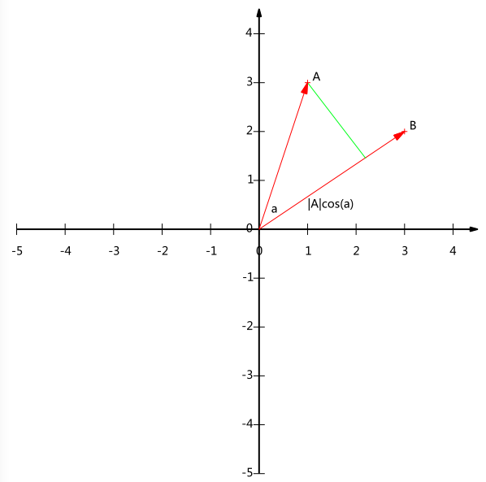
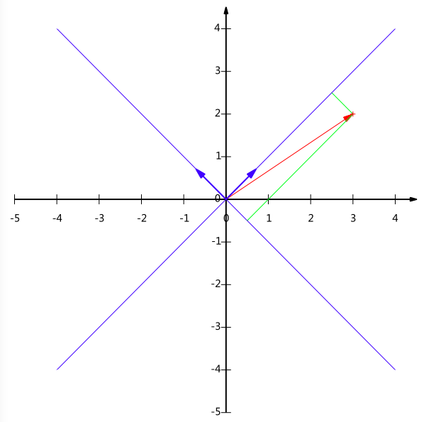

摘自：张洋, http://blog.codinglabs.org/articles/pca-tutorial.html

### 1 什么是 PCA

PCA（Principal Component Analysis）是一种常用的数据分析方法。

PCA通过线性变换将原始数据变换为一组各维度**线性无关**的表示，可用于提取数据的主要特征分量，常用于高维数据的降维。

### 2 数据向量的表示及降维问题

#### 2.1 数据向量的表示

一般情况下，在数据挖掘和机器学习中，数据被表示为向量，如（日期，浏览量，访客数，下单数，成交数，成交金额）表示为：
$$
(500,240,25,13,2312.15)^𝖳
$$
其中日期是一个记录标志而非度量值，而数据挖掘关心的大多是度量值，因此如果我们忽略日期这个字段后得到一个五维向量。

#### 2.2 为什么要降维

实际机器学习中处理**成千上万甚至几十万维**的情况也并不罕见，在这种情况下，机器学习的资源消耗是不可接受的，因此我们必须对数据进行降维。

降维当然意味着信息的丢失，不过鉴于实际数据本身常常存在的相关性，我们可以想办法在降维的同时将信息的损失尽量降低。

#### 2.3 如何进行降维

举个例子，假如某学籍数据有两列 M 和 F ，其中 M 列的取值是如何此学生为男性取值 1，为女性取值 0；而F列是学生为女性取值 1，男性取值 0。此时如果我们统计全部学籍数据，会发现对于任何一条记录来说，当 M 为1时 F 必定为0，反之当 M 为0时 F 必定为1。在这种情况下，我们将 M 或 F 去掉实际上没有任何信息的损失，因为只要保留一列就可以完全还原另一列。

当然上面是一个极端的情况，在现实中也许不会出现，不过类似的情况还是很常见的。例如上面淘宝店铺的数据，从经验我们可以知道，**“浏览量”和“访客数”往往具有较强的相关关系**，而“下单数”和“成交数”也具有较强的相关关系。这里我们非正式的使用“相关关系”这个词，可以直观理解为“当某一天这个店铺的浏览量较高（或较低）时，我们应该很大程度上认为这天的访客数也较高（或较低）”。后面的章节中我们会给出相关性的严格数学定义。

这种情况表明，如果我们**删除浏览量或访客数其中一个指标，我们应该期待并不会丢失太多信息**。因此我们可以删除一个，以降低机器学习算法的复杂度。

上面给出的是降维的朴素思想描述，可以有助于直观理解降维的动机和可行性，但并不具有操作指导意义。例如，我们到底删除哪一列损失的信息才最小？亦或根本不是单纯删除几列，而是通过某些变换将原始数据变为更少的列但又使得丢失的信息最小？到底如何度量丢失信息的多少？如何根据原始数据决定具体的降维操作步骤？

### 3 向量的表示及基变换

#### 3.1 内积

内积运算将两个向量映射为一个实数，两个维数相同的向量的内积被定义为：
$$
(a_1,a_2,⋯,a_n)^𝖳\cdot(b_1,b_2,⋯,b_n)^𝖳=a_1b_1+a_2b_2+⋯+a_nb_n
$$
假设 A 和 B 是两个 n 维向量，我们知道 n 维向量可以等价表示为 n 维空间中的一条从原点发射的有向线段，为了简单起见我们假设 A 和 B 均为二维向量，则$ A=(x_1,y_1)，B=(x_2,y_2)$ 。则在二维平面上 A 和 B 可以用两条发自原点的有向线段表示，见下图：

从 A 点向 B 所在直线引一条垂线。我们知道垂线与 B 的交点叫做 A 在 B 上的投影，再设 A 与 B 的夹角是 $\alpha$，则投影的矢量长度为 $|A|cos(\alpha)$，其中 $|A|=\sqrt{x_1^2 + y_1^2}$ 是向量 A 的模，也就是 A 线段的**标量**长度。

注意这里我们专门区分了矢量长度和标量长度，标量长度总是大于等于0，值就是线段的长度；而矢量长度可能为负，其绝对值是线段长度，而符号取决于其方向与标准方向相同或相反。

内积还可以表示为：
$$
A⋅B=|A||B|cos(\alpha)
$$
**设向量B的模为1，则A与B的内积值等于A向B所在直线投影的矢量长度**

#### 3.2 基

在代数表示方面，我们经常用线段终点的点坐标表示向量，例如一个向量可以表示为 $(3,2)$，这是我们再熟悉不过的向量表示。

不过我们常常忽略，**只有一个 $(3,2)$ 本身是不能够精确表示一个向量的**。我们仔细看一下，这里的3实际表示的是向量在 x 轴上的投影值是3，在 y 轴上的投影值是2。也就是说我们其实隐式引入了一个定义：以 x 轴和 y 轴上正方向长度为1的向量为标准。那么一个向量 $(3,2)$ 实际是说在 x 轴投影为3而 y 轴的投影为2。注意投影是一个矢量，所以可以为负。

正式的说，向量 $(x,y)$ 实际上表示线性组合：
$$
x(1,0)^𝖳+y(0,1)^𝖳
$$
不难证明所有二维向量都可以表示为这样的线性组合。此处(1,0)和(0,1)叫做二维空间中的一组基。

**要准确描述向量，首先要确定一组基，然后给出在基所在的各个直线上的投影值，就可以了**。

例如， $(1,1)$ 和 $(-1,1)$ 也可以成为一组基。一般来说，我们希望基的模是1，因为从内积的意义可以看到，如果基的模是1，那么就可以方便的**用向量点乘基而直接获得其在新基上的坐标了**！

实际上，对应任何一个向量我们总可以找到其同方向上模为1的向量，只要让两个分量分别除以模就好了。例如，上面的基可以变为 $(\frac{1}{\sqrt2},\frac{1}{\sqrt2})$ 和 $(-\frac{1}{\sqrt2},\frac{1}{\sqrt2})$。

现在，我们想获得(3,2)在新基上的坐标，即在两个方向上的投影矢量值，那么根据内积的几何意义，我们只要分别计算(3,2)和两个基的内积，不难得到新的坐标为 $(\frac{5}{\sqrt2},-\frac{1}{\sqrt2})$。下图给出了新的基以及 $(3,2)$ 在新基上坐标值的示意图：

另外这里要注意的是，我们列举的例子中基是正交的（即内积为0，或直观说相互垂直），但可以成为一组基的**唯一要求就是线性无关**，**非正交的基也是可以的**。不过因为正交基有较好的性质，所以一般使用的基都是正交的。

#### 3.3 基变换的矩阵表示

$(3,2)$ 的变换：
$$
\begin{pmatrix} 
\frac{1}{\sqrt2} & \frac{1}{\sqrt2} \\ 
-\frac{1}{\sqrt2} & \frac{1}{\sqrt2} \\ 
\end{pmatrix} 
\begin{pmatrix} 
3 \\
2
\end{pmatrix}
 = 
 \begin{pmatrix} 
\frac{5}{\sqrt2} \\
-\frac{1}{\sqrt2} 
\end{pmatrix}
$$
$(1,1),(2,2),(3,3)$ 的变换：
$$
\begin{pmatrix} 
\frac{1}{\sqrt2} & \frac{1}{\sqrt2} \\ 
-\frac{1}{\sqrt2} & \frac{1}{\sqrt2} \\ 
\end{pmatrix} 
\begin{pmatrix} 
1 & 2 & 3\\
1 & 2 & 3
\end{pmatrix}
 = 
 \begin{pmatrix} 
\frac{2}{\sqrt2} & \frac{4}{\sqrt2} & \frac{6}{\sqrt2}\\
0 & 0 & 0
\end{pmatrix}
$$
