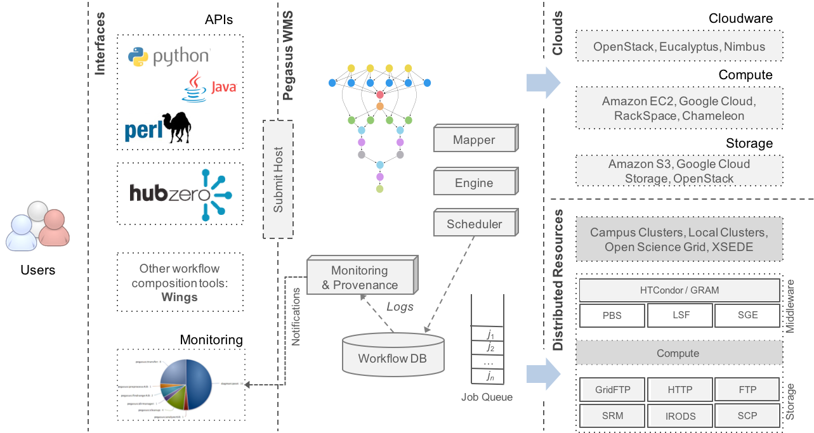

### What are scientific workflows?

Scientific workflows allow users to easily express multi-step computational tasks, for example retrieve data from an instrument or a database, reformat the data, and run an analysis. 

A scientific workflow describes the dependencies between the tasks and in most cases the workflow is described as a directed acyclic graph (DAG), where the nodes are tasks and the edges denote the task dependencies.

A defining property for a scientific workflow is that **it manages data flow**. The tasks in a scientific workflow can be everything  from short serial tasks to very large parallel tasks (MPI for example) surrounded by a large number of small, serial tasks used for pre- and post-processing.

### What is Pegasus

The Pegasus project encompasses a set of technologies that help workflow-based applications execute in a number of different environments including desktops, campus clusters, grids, and clouds. 

Pegasus bridges the scientific domain and the execution environment by automatically mapping high-level workflow descriptions onto distributed resources. It automatically locates the necessary input data and computational resources necessary for workflow execution.

Pegasus **enables scientists to construct workflows** in abstract terms without worrying about the details of the underlying execution environment or the particulars of the low-level specifications required by the middleware (Condor, Globus, or Amazon EC2). Pegasus also bridges the current cyberinfrastructure by effectively coordinating multiple distributed resources.

Pegasus has been used in a number of scientific domains including astronomy, bioinformatics, earthquake science , gravitational wave physics, ocean science, limnology, and others. When errors occur, Pegasus tries to recover when possible by retrying tasks, by retrying the entire workflow, by providing workflow-level checkpointing, by re-mapping portions of the workflow, by trying alternative data sources for staging data, and, when all else fails, by providing a rescue workflow containing a description of only the work that remains to be done. It cleans up storage as the workflow is executed so that data-intensive workflows have enough space to execute on storage-constrained resources. Pegasus keeps track of what has been done (provenance) including the locations of data used and produced, and which software was used with which parameters.

### Applications

1. BroadBand
2. CGSMD
3. CNV
4. **CyberShake** 预测地震
5. FutureGrid
6. GRIDCHEM
7. Helio Seismology
8. IMG
9. **LIGO** 测引力波
10. LQCD
11. **Montage** 生成天体图像
12. Montage Galactic Plane
13. OpenSees Workflows on NeesHub
14. PedWork
15. Periodograms (IPAC)
16. Proteomics
17. SCB
18. SIPHT
19. UCLA Genome Center

### How to simulate

**Data:** 

[Workflow Generator](https://confluence.pegasus.isi.edu/display/pegasus/WorkflowGenerator)

**Simulation tool:**

[WorkflowSim](http://workflowsim.org/)

### References

[1] https://pegasus.isi.edu/overview/

[2] https://confluence.pegasus.isi.edu/display/pegasus/Applications