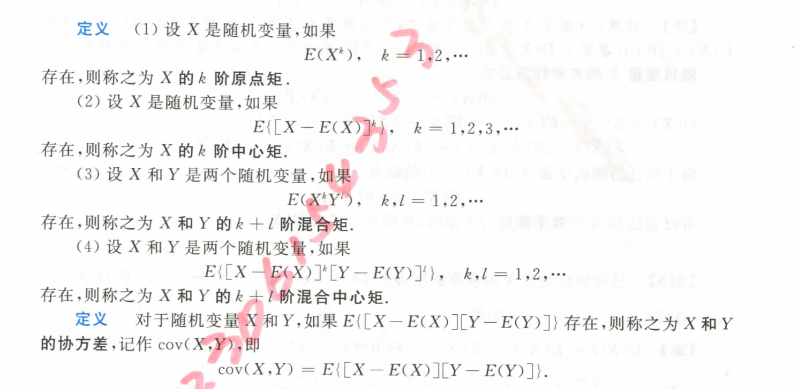

### 1 什么是统计中的矩（moment）

在实践中，每一个 X 的矩都告诉你一些关于 X 分布的信息[1]

数学中矩的概念来自于物理学[2]

### 2 什么是中心距

在概率论或者统计学中，中心矩(Central Moment)是关于某一个随机变量平均值构成随机变量的概率分布的矩。

### 3 中心矩的定义

对于一维随机变量$\ X$ ，其$\ k $ 阶中心距$\ \mu_{k}$ 为相对于$\ X$ 的期望值的$\ k$ 阶矩：
$$
\mu_{k} = E[X-E[X]^{k}] = \int_{-\infty}^{+\infty}(x-\mu)^{k}f(x)dx
$$

### 4 特定距的意义

前几阶中心矩具有较直观的意义

* 第0阶中心矩 $\mu_{0}​$ 恒为1

* 第1阶中心矩 $\mu_{1}$ 恒为0

* 第2阶中心矩 $\mu_{2}$ 为 $X$ 的方差（Variance）
  $$
  Var(x) = \int_{-\infty}^{+\infty} [(x-E(x)]^{2}f(x)dx
  $$

* 第3阶中心矩 $ \mu_{3}$ 用于定义 $X$ 的偏度（Skewness）
  $$
  S(x) = \int_{-\infty}^{+\infty} [(x-E(x)]^{3}f(x)dx
  $$

* 第4阶中心矩 $\mu_{4}$ 用于定义 $X$ 的峰度（Kurtosis）
  $$
  K(x) = \int_{-\infty}^{+\infty} [(x-E(x)]^{4}f(x)dx
  $$

随机变量（或统计量，下同）的期望（Expectation）定义为其1阶原点矩：
$$
E(x) = \int_{-\infty}^{+\infty}xf(x)dx
$$

### 参考

[1] 姚岑卓, https://www.zhihu.com/question/25344430

[2] wikipedia, https://zh.wikipedia.org/wiki/%E7%9F%A9_(%E6%95%B8%E5%AD%B8)